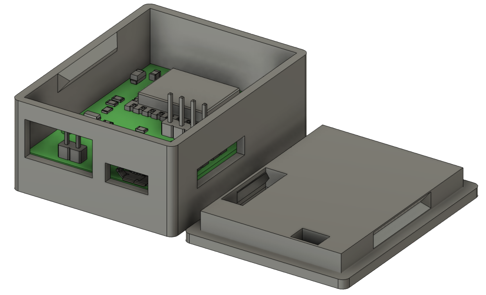

# ESP USB/Mosfet Switch
 
 A small PCB, based on an ESP12E to switch USB or general 3.3V / 5V devices via Headers.
 Created with KiCad
 
## Current status: Ordered 
 
## Features

- 1. Multiple input selection
   - 12V/5V/3.3V via Headers
   - 5V via micro USB
   - 5V via USB-C

- 2. Multiple output selection
   - 12V/5V/3.3V via Headers (selectable via solderjumper)
   - 5V via USB-A 
   - 5V via USB-C
   
- 3. Read Current via INA226

- 4. Onboard WS2812B LED
	- control additional digital LEDs
	

## The Hardware:




## Example configuration

```yaml
# Configuration for ESPHOME
```

## Contributions

Feel free to open Pull Requests here
