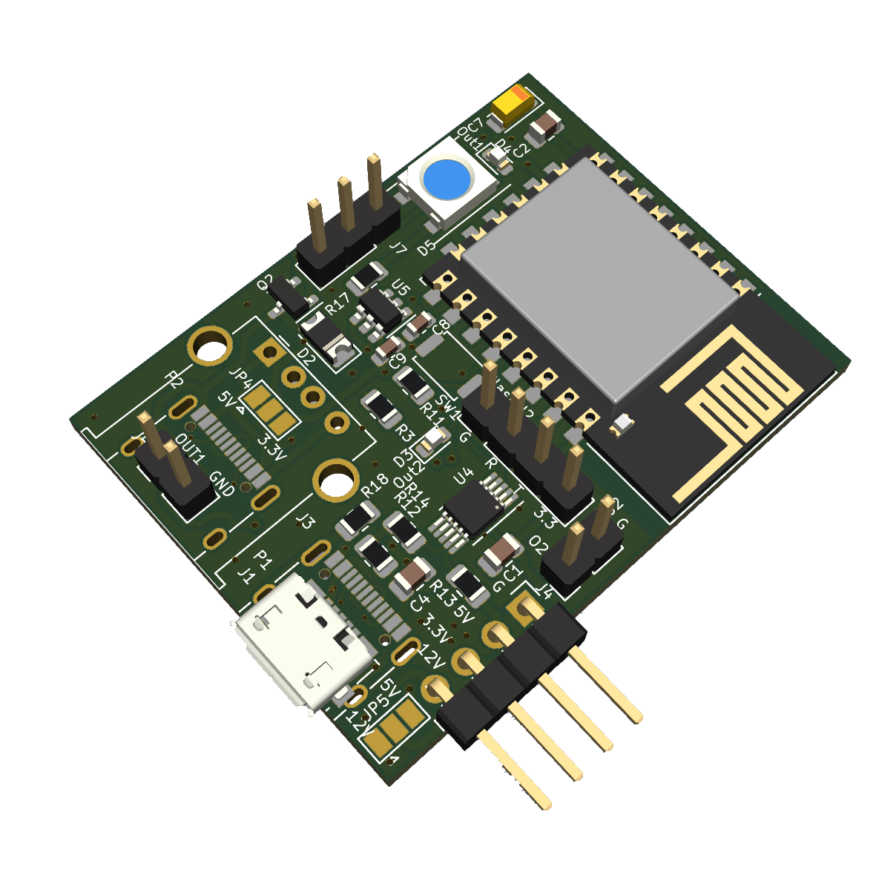

# ESP USB/Mosfet Switch
 
 A small PCB, based on an ESP12E to switch USB or general 3.3V / 5V devices via Headers.
 Created with KiCad
 
## Current status: Ordered 
 
## Features

1  Read Current via INA226

2  Two Outputs
	- One either USB or Header
	- Both selectable for 3.3V / 5V output
	

## The Hardware:




## Example configuration

```yaml
# Configuration for ESPHOME
```

## Contributions

Feel free to open Pull Requests here
